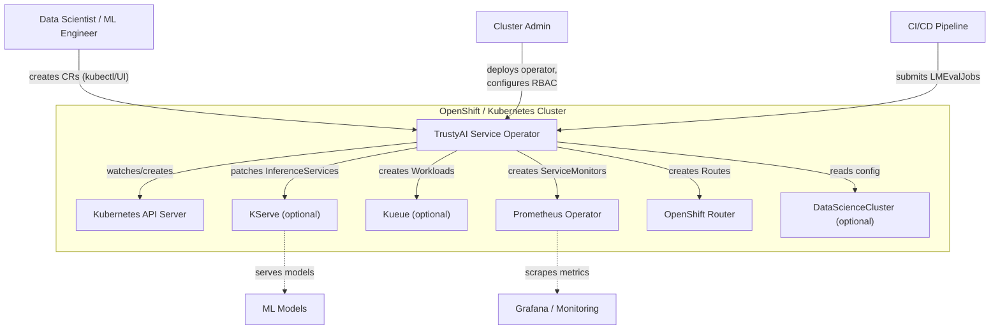
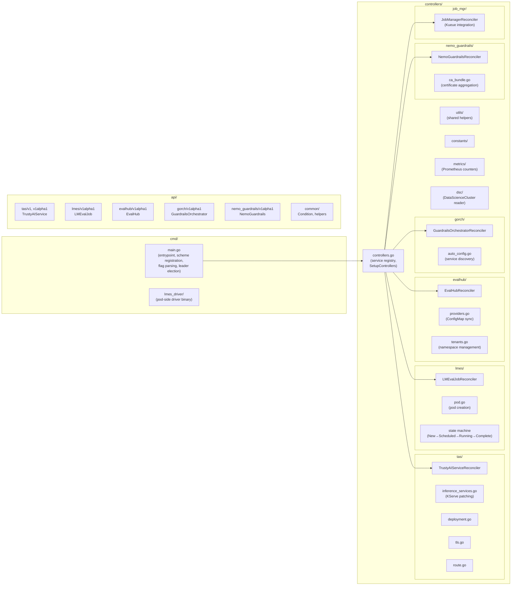
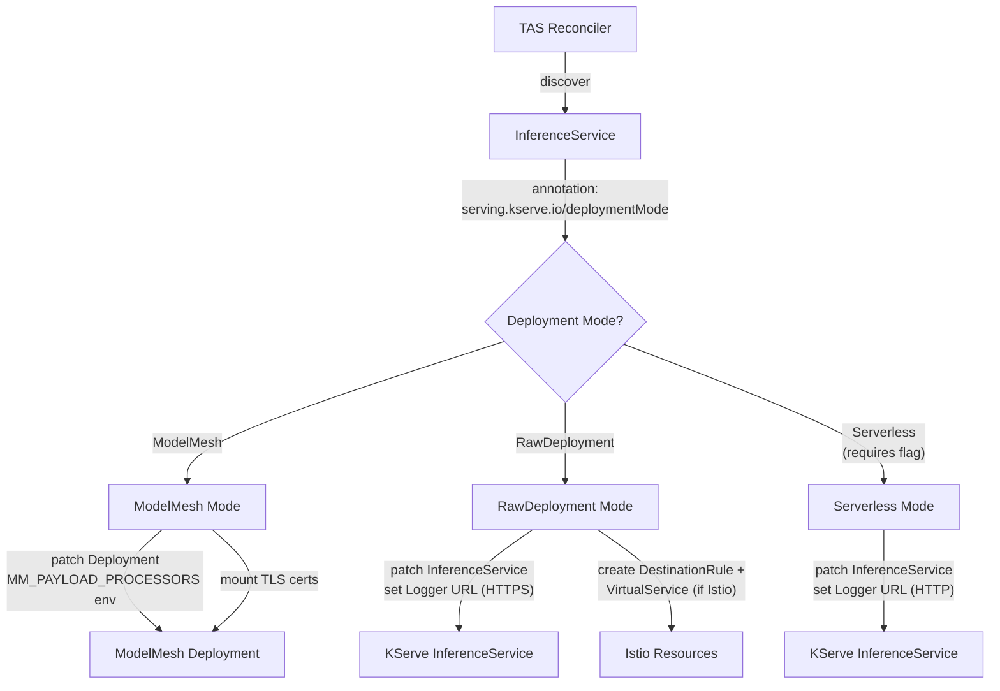
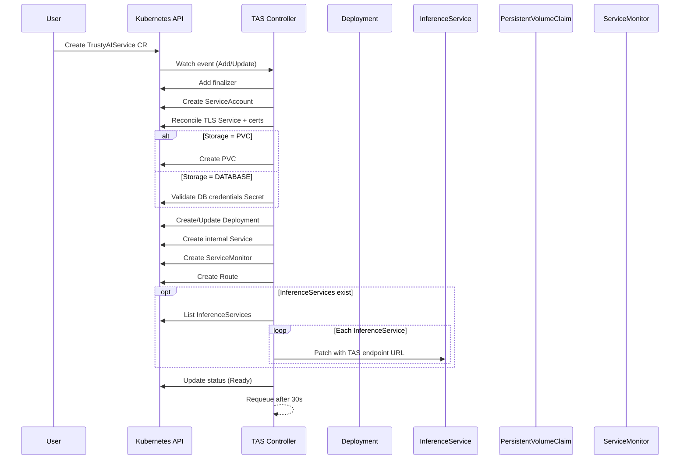
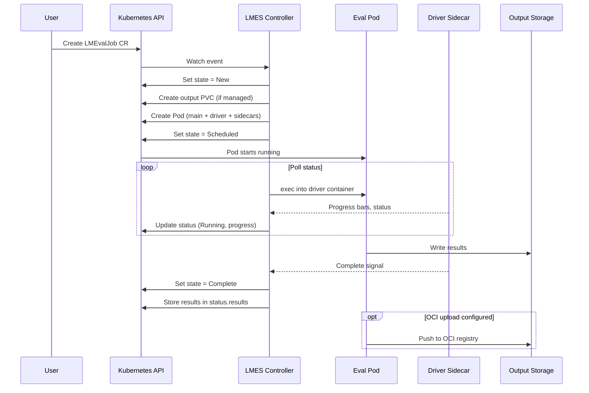
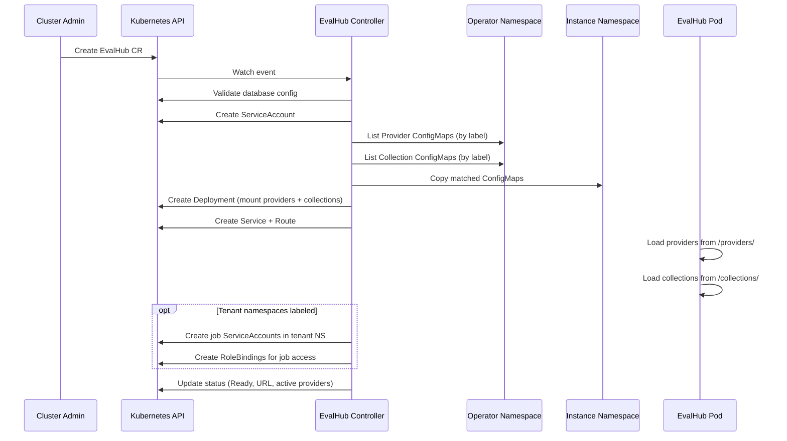
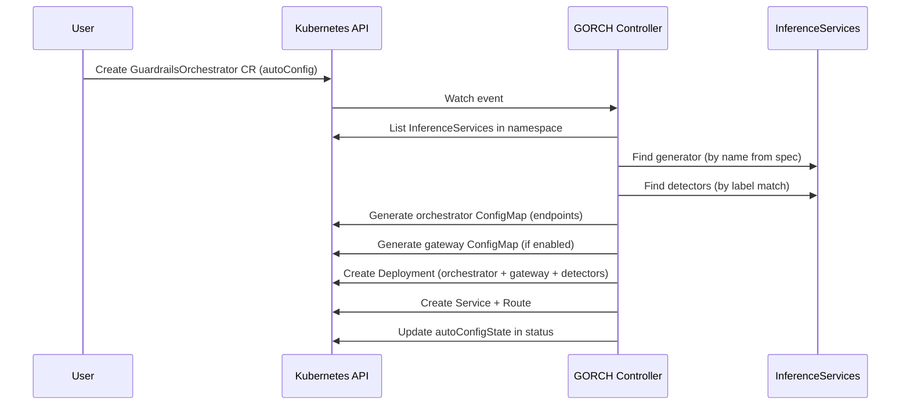
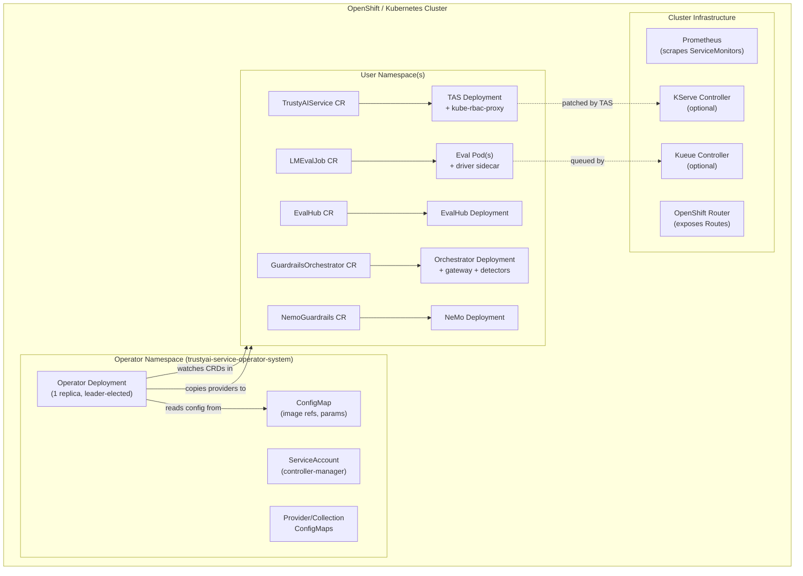

# Architecture: TrustyAI Service Operator

> Auto-generated on 2026-05-06. Manual edits welcome — re-running the command will overwrite this file.

## Overview

The TrustyAI Service Operator is a Kubernetes operator that manages the lifecycle of AI/ML trust, safety, and evaluation services on OpenShift AI. It deploys and configures five distinct service types — model explainability (TAS), LLM evaluation (LMES), evaluation hub (EvalHub), guardrails orchestration (GORCH), and NeMo Guardrails — through a single operator binary with dynamic controller registration.

Built with kubebuilder v4 and controller-runtime v0.17.0 in Go 1.24, the operator uses a plugin-based architecture where controllers are selectively enabled via a startup flag (`--enable-services`). Each controller watches its own CRD and reconciles the desired state by creating Deployments, Services, Routes, ConfigMaps, RBAC resources, and monitoring infrastructure.

The operator integrates with KServe (optional) for inference service patching, Kueue for job queuing, Prometheus for monitoring, and OpenShift for route/TLS management. It is deployed via Kustomize with environment-specific overlays (ODH, RHOAI, single-service modes).

## Context Diagram



## Container Diagram

```mermaid
flowchart TB
    subgraph operator_pod["Operator Pod"]
        manager["manager binary\n(Go, controller-runtime)"]
    end

    subgraph tas_pod["TrustyAI Service Pod(s)"]
        tas_svc["TrustyAI Service\n(explainability, fairness,\ndrift monitoring)"]
        tas_proxy["kube-rbac-proxy\n(auth sidecar)"]
    end

    subgraph lmes_pod["LMEvalJob Pod"]
        lmes_main["lm-eval container\n(evaluation harness)"]
        lmes_driver["driver sidecar\n(status reporting)"]
        lmes_sidecars["user sidecars\n(optional)"]
    end

    subgraph evalhub_pod["EvalHub Pod(s)"]
        evalhub_svc["EvalHub Service\n(REST API, job management)"]
    end

    subgraph gorch_pod["Guardrails Orchestrator Pod(s)"]
        gorch_svc["Orchestrator\n(guardrail chains)"]
        gorch_gw["Gateway sidecar\n(optional)"]
        gorch_det["Built-in detectors\n(optional)"]
    end

    subgraph nemo_pod["NeMo Guardrails Pod(s)"]
        nemo_svc["NeMo Guardrails Server\n(NVIDIA NeMo)"]
    end

    manager -->|"watch CRDs,\ncreate resources"| k8s_api["Kubernetes API"]
    manager -->|"creates/manages"| tas_pod
    manager -->|"creates/manages"| lmes_pod
    manager -->|"creates/manages"| evalhub_pod
    manager -->|"creates/manages"| gorch_pod
    manager -->|"creates/manages"| nemo_pod

    tas_svc -->|"HTTP/gRPC"| model_endpoints["KServe InferenceServices"]
    lmes_main -->|"evaluates"| model_endpoints
    evalhub_svc -->|"submits LMEvalJobs"| k8s_api
    gorch_svc -->|"intercepts inference"| model_endpoints
    nemo_svc -->|"guards inference"| model_endpoints

    evalhub_svc -->|"SQLite / PostgreSQL"| db["Database"]
    evalhub_svc -->|"OTLP"| otel["OpenTelemetry Collector"]
```



## Component Diagram

### Operator Internals



### KServe Integration Modes (TAS Controller)



## Configuration Modes

| Mode | Enabled Services | Use Case | Overlay |
|------|-----------------|----------|---------|
| **ODH (full)** | TAS, LMES, GORCH, NEMO_GUARDRAILS, EVALHUB | Open Data Hub — all AI trust services | `config/overlays/odh/` |
| **RHOAI (full)** | TAS, LMES, GORCH, NEMO_GUARDRAILS, EVALHUB | Red Hat OpenShift AI — production | `config/overlays/rhoai/` |
| **ODH + Kueue** | TAS, LMES, GORCH, NEMO_GUARDRAILS, EVALHUB, JOB_MGR | Full + job queuing via Kueue | `config/overlays/odh-kueue/` |
| **LMES only** | LMES | LLM evaluation workloads only | `config/overlays/lmes/` |
| **EvalHub only** | EVALHUB | Evaluation hub service only | `config/overlays/evalhub-only/` |
| **NeMo only** | NEMO_GUARDRAILS | NeMo Guardrails only | `config/overlays/mcp-guardrails/` |

### Component Dependency Matrix

| Component | KServe | Kueue | Prometheus | OpenShift Routes | Database |
|-----------|--------|-------|------------|-----------------|----------|
| **TAS** | Optional (3 modes) | -- | Yes (ServiceMonitor) | Yes | Optional (PVC or DB) |
| **LMES** | -- | Optional (via JOB_MGR) | -- | -- | -- |
| **EvalHub** | -- | Optional (workload monitoring) | Yes | Yes | Required (SQLite or PostgreSQL) |
| **GORCH** | Optional (auto-config) | -- | Yes | Yes | -- |
| **NeMo Guardrails** | -- | -- | -- | Yes | -- |
| **JOB_MGR** | -- | Required | -- | -- | -- |

### KServe: Not Mandatory

KServe is **not a mandatory dependency**. The operator behaves as follows:

- **TAS controller**: Watches InferenceService objects. If none exist in the namespace, reconciliation continues without error. When InferenceServices are present, TAS patches them with payload-processing endpoints based on the deployment mode annotation.
- **GORCH controller**: Uses InferenceServices for auto-configuration (discovering generator and detector services). Falls back to manual ConfigMap-based configuration if KServe is unavailable.
- **LMES, EvalHub, NeMo**: No KServe dependency.

## Data and Message Flow

### TrustyAI Service Reconciliation



### LMEvalJob Lifecycle



### EvalHub Provider/Collection Flow



### Guardrails Auto-Configuration



## Dependencies

### Mandatory

- **Kubernetes** v1.19+ or **OpenShift** v4.6+
- **controller-runtime** v0.17.0 — operator framework
- **client-go** v0.29.2 — Kubernetes API client
- **Prometheus Operator** — for ServiceMonitor CRD (operator creates these)

### Optional

- **KServe** v0.12.1 — enables TAS inference service patching and GORCH auto-configuration
- **Kueue** v0.6.2 — enables job queuing for LMEvalJobs (requires JOB_MGR service)
- **Istio** — enables DestinationRule/VirtualService creation for service mesh traffic management (TAS with RawDeployment mode)
- **OpenShift Routes** — enables external HTTP/HTTPS access via Routes (gracefully skipped on vanilla Kubernetes)
- **DataScienceCluster** — enables DSC-based configuration merging (ODH/RHOAI environments)

## Key Design Decisions

- **Dynamic controller registration via `init()`**: Each service registers its setup function at import time. The `--enable-services` flag selects which controllers to start. This allows a single binary to serve multiple deployment profiles without conditional compilation.
- **Component-based Kustomize**: Services are modelled as Kustomize Components, enabling mix-and-match RBAC and CRD inclusion per overlay without duplication.
- **Cache disabled for high-churn resources**: ConfigMaps, Secrets, Pods, and Services bypass the informer cache to prevent OOM in large clusters. The ~50ms direct-read latency is acceptable for these infrequent lookups.
- **ConfigMap-driven operator configuration**: All image references and runtime parameters live in a ConfigMap (`trustyai-service-operator-config`), not hardcoded. Overlays swap the ConfigMap contents per environment.
- **Finalizer-based cleanup**: Every controller uses finalizers to ensure child resources (PVCs, ConfigMaps, Routes, RBAC bindings) are properly cleaned up on CR deletion.
- **Pod-based evaluation (LMES)**: LMEvalJobs run as Pods (not Jobs) with a driver sidecar for status reporting. This gives the controller direct exec access for progress monitoring and supports Kueue's suspend/resume semantics.
- **Tenant namespace model (EvalHub)**: EvalHub creates job ServiceAccounts in labeled tenant namespaces, allowing multi-tenant evaluation workloads with scoped RBAC.

## Deployment

The operator is deployed via Kustomize with environment-specific overlays. A single Deployment runs the operator binary with selected services enabled.



### Build and Deploy

```bash
# Build
make docker-build IMG=quay.io/trustyai/trustyai-service-operator:latest

# Deploy with ODH overlay (all services)
make deploy OVERLAY=odh

# Deploy with single-service overlay
make deploy OVERLAY=lmes

# Local development
make run ENABLED_SERVICES=TAS,LMES,EVALHUB
```

## Directory Structure

```
trustyai-service-operator/
├── cmd/
│   ├── main.go                    # Entrypoint, scheme registration, flag parsing
│   └── lmes_driver/               # Driver binary for LMES pod execution
├── api/
│   ├── common/                    # Shared types (Condition)
│   ├── tas/v1/                    # TrustyAIService v1 (storage version)
│   ├── tas/v1alpha1/              # TrustyAIService v1alpha1 (deprecated)
│   ├── lmes/v1alpha1/             # LMEvalJob types
│   ├── evalhub/v1alpha1/          # EvalHub types
│   ├── gorch/v1alpha1/            # GuardrailsOrchestrator types
│   └── nemo_guardrails/v1alpha1/  # NemoGuardrails types
├── controllers/
│   ├── controllers.go             # Service registry (init-based registration)
│   ├── tas/                       # TAS reconciler (KServe, TLS, storage)
│   ├── lmes/                      # LMES reconciler (pod lifecycle, state machine)
│   ├── evalhub/                   # EvalHub reconciler (providers, tenants, DB)
│   ├── gorch/                     # GORCH reconciler (auto-config, detectors)
│   ├── nemo_guardrails/           # NeMo reconciler (CA bundles)
│   ├── job_mgr/                   # Kueue job manager
│   ├── utils/                     # Shared reconciliation helpers
│   ├── constants/                 # Shared constants
│   ├── metrics/                   # Prometheus metric definitions
│   └── dsc/                       # DataScienceCluster config reader
├── config/
│   ├── base/                      # Base Kustomize layer (manager, params)
│   ├── components/                # Per-service CRDs, RBAC (Kustomize Components)
│   ├── overlays/                  # Environment overlays (odh, rhoai, lmes, etc.)
│   ├── configmaps/evalhub/        # Provider and collection YAML definitions
│   ├── rbac-base/                 # Shared RBAC (leader election, auth proxy)
│   ├── prometheus/                # ServiceMonitor definitions
│   └── samples/                   # Example CRs
├── tests/                         # Integration tests (envtest)
├── hack/                          # Build scripts, RBAC extraction, provider sync
├── Dockerfile                     # Multi-stage build (UBI9 Go → UBI8 minimal)
├── Makefile                       # Build, test, deploy targets
└── go.mod                         # Go 1.24, controller-runtime v0.17.0
```
