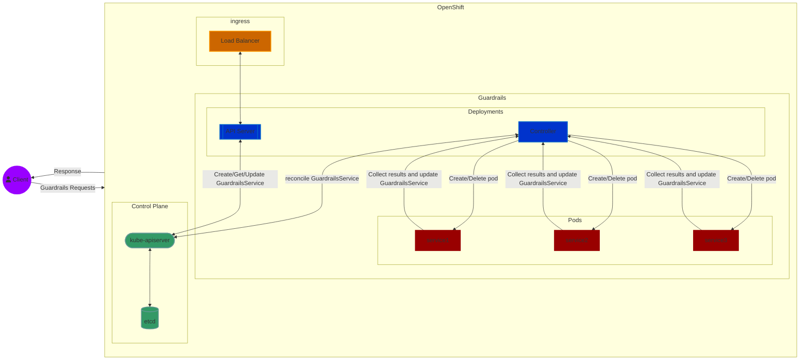
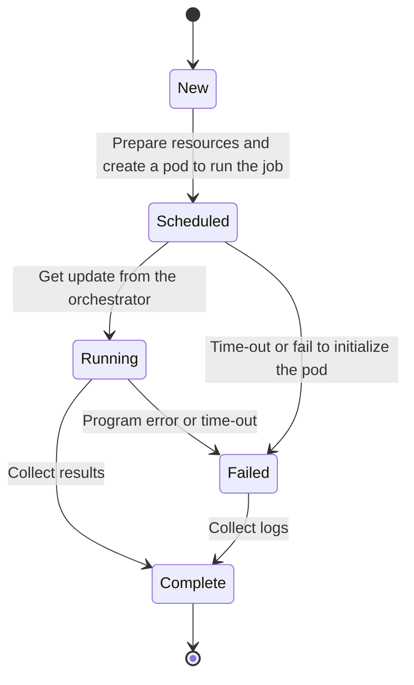

# The Backend of Guardrails Orchestrator

* CustomResourceDefinition: The CRD defines the components of GuardrailsOrchestator which are the generator, chunker, and detector
    * Kind: `GuardrailsService`
    * Version: `v1alpha1`
* Controller: The controller reconciles the `GuadrailsSevice` custom resources, creates corresponding Pods, stores results, and cancels services.

## High Level Architecture

## State Transition of a GuardrailsService

## Design

### Custom Resource Definition (CRD)
The data structure for a GuardrailsService contains the following fields:

| GuardrailsService | Data Type | Optional | Parameter in GuardrailsService | Description
| --- | --- | --- | --- | -- |
| Generator | string | | --generator | Generator name or ID|
| Detector | string |  | --detector | Detector name or ID |
| DetectorArgs | []string |  | --detector_args | Configurations for the selected detector. The data is converted to a string in this format and passed to the GuardrailsService: `arg1=val1,arg2=val2` |
| Chunker | string | ✅ | --chunker | Chunker name or ID |
| ChunkerArgs | []string | ✅ | --chunker_args | Configurations for the selected chunker. The data is converted to a string in this format and passed to the GuardrailsService: `arg1=val1,arg2=val2` |

The `Status` subresource of the `GuardrailsService` CRB contains the following information:

* `PodName`: the name of the Pod that runs the guardrails service
* `State`: records the status of the  guardrails service. Possible values are:
    * `New`: the service is created but not yet processed by the controller
    * `Scheduled`: a Pod is created by the controller for the service
    * `Running`: the Pod for the service is running
    * `Complete`: the service request finishes or fails
    * `Cancelled`: the controller canceled the service and will mark it as complete
* `Reason`: details about the current state.
    * `NoReason`: there is no information about the current state
    * `Succeeded`: the service finished successfully
    * `Failed`: the service failed
    * `Cancelled`: the service is cancelled
* `Message`: additional details about the final state
* `LastScheduleTime`: timestamp of when the Pod is scheduled
* `CompleteTime`: timestamp of when the service's state is `Complete`
* `Results`: stores the results of the guardrails service results

## The Controller
The controller is responsible for monitoring the `GuardrailsService` CRs and reconciling the corresponding Pods. Here are the details of how the controller handles an `GuardrailsService` CR:
* ConfigMap: provides the controller with instructions on how to configure the `GuardrailsService` CR:
    * orchestrator-image: Contains the orchestrator binary. Used in the `init` container
    * pod-image: Used in the `main` container
    * pod-checking-interval: The controller checks the scheduled pods at a fixed time interval. The defualt value is `10s`
    * image-pull-policy: Default value is `Always`

* Arguments: the controller supports the following command line arguments:
    * `--namespace`: the namespace where you deploy the controller. By default, the namespace of the controller deployment is used
    * `--configmap`: the name of the ConfigMap where the config settings are stored

* Finalizer: The controller is one of `GuardrailsService`'s finalizers. Ensures the controller reconciles `GuardrailsService`'s before deletion

## The Orchestrator